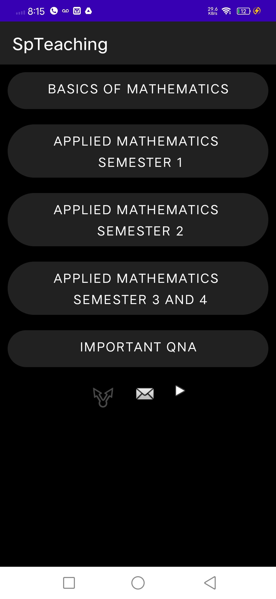

# SpTeachingAndroid

App Link: https://play.google.com/store/apps/details?id=com.spteach.spteachfinal

	<ul>
		<li>Home Page</li>
		
		<li>Login</li>
		
    <li>Signup</li>
		
  <li>Order</li>
		
  <li>Menu</li>
		
  <li>Cart</li>
		
  </ul>

